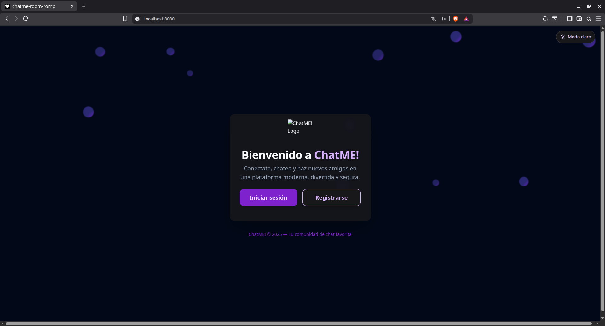
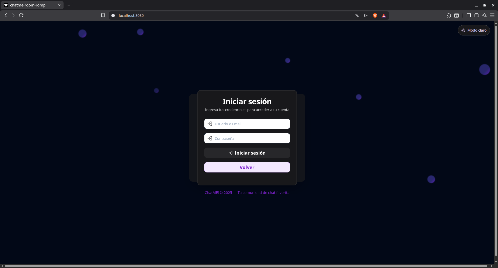
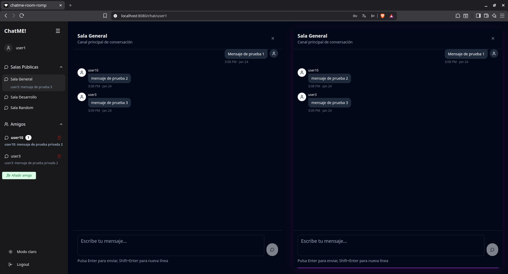
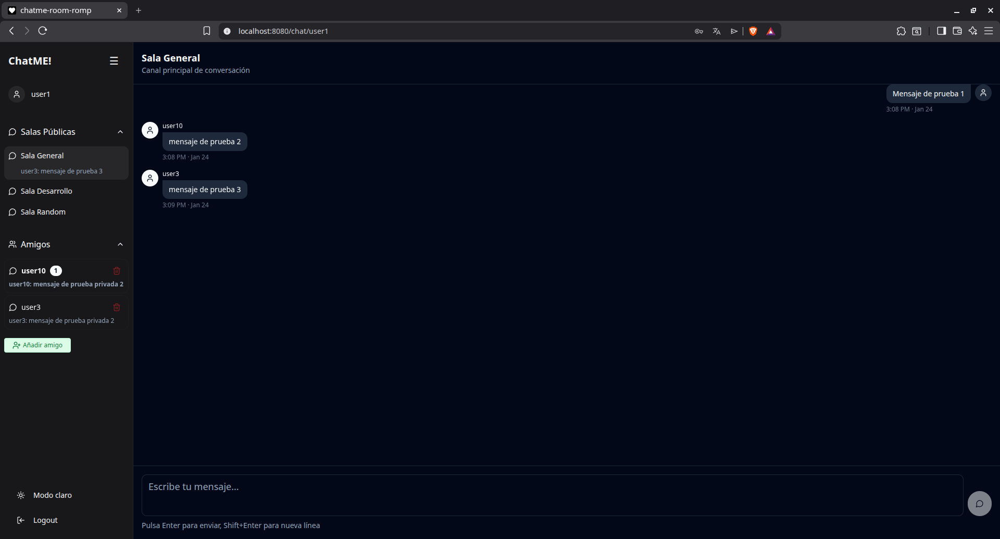

# ChatME

ChatME is a real-time chat application built with React, TypeScript, Flask, Socket.IO, and PostgreSQL. It supports public rooms and private conversations, with a strong focus on responsiveness, real-time communication, clean architecture, and maintainability.

The project is designed as a scalable foundation for modern chat systems, combining a reactive frontend, a Python backend, persistent data storage, and real-time bidirectional communication.

<p align="center">
  
</p>

## Screenshots

<p align="center">
  
  
  
</p>

## Overview

ChatME is a full-stack chat platform that allows users to communicate through public rooms and private conversations in real time. It is built to provide a responsive and intuitive user experience across desktop, tablet, and mobile devices.

The project also serves as a solid base for experimenting with scalable messaging architecture, real-time event handling, authentication flows, and modern frontend-backend integration.

## Current Status

The project is in active development and already includes a functional real-time chat experience with a structured full-stack architecture.

At its current stage, ChatME includes:
- Real-time messaging with Socket.IO
- Public rooms and private chats
- Parallel chat windows with drag-and-drop interaction
- JWT-based authentication
- Password hashing with bcrypt
- Responsive UI across multiple device sizes
- Docker-based local and production-ready setup
- Project documentation for development and security workflows

The current focus is on refining the user experience, improving internal architecture, and continuing to strengthen deployment and maintainability.

## Features

- Real-time communication with Socket.IO
- Public chat rooms and private messaging
- Parallel chat windows with drag-and-drop support
- Responsive interface for desktop, tablet, and mobile
- JWT authentication and secure password storage
- Flask backend with PostgreSQL persistence
- Docker Compose setup for local development and deployment
- Clear project structure and supporting documentation

## Tech Stack

**Frontend**
- React
- TypeScript
- Vite

**Backend**
- Flask
- Flask-SocketIO
- Python

**Database and Services**
- PostgreSQL
- Redis

**Infrastructure**
- Docker
- Docker Compose
- Nginx

## Project Structure

```plaintext
ChatME/
├── .github/
│   ├── assets/
│   │   ├── chatme-bienvenida.png
│   │   ├── chatme-chat-paralelo.png
│   │   ├── chatme-iniciar-sesion.png
│   │   ├── chatme-perfil.png
│   │   └── chatme-sala-chat.png
│   ├── CHANGELOG.md
│   ├── DEVELOPMENT.md
│   └── SECURITY.md
├── backend/
├── database/
├── frontend/
├── .env.example
├── .gitignore
├── docker-compose.yml
├── nginx.conf
├── README.md
├── RULES.md
├── setup-db.ps1
├── setup-db.sh
└── STANDARDS.md
```

## Getting Started

Clone the repository:

```bash
git clone https://github.com/GabrixuGames/ChatME.git
cd ChatME
```

Create and configure your environment file:

```bash
cp .env.example .env
```

Update `.env` with your local or production values before starting the services.

### Local Development

Start the required services:

```bash
docker-compose up -d postgres redis
```

Run the backend:

```bash
cd backend
python -m venv .venv
source .venv/bin/activate
pip install -r requirements.txt
python app.py
```

Run the frontend in a separate terminal:

```bash
cd frontend
npm install
npm run dev
```

### Full Docker Setup

To run the full application stack with Docker:

```bash
docker-compose up --build -d
```

## Usage

### Local development
- Frontend: `http://localhost:8080`
- Backend: `http://localhost:5000`

### Docker deployment
- Application: `http://localhost`
- API: `http://localhost/api`

Basic flow:
1. Sign in or create an account.
2. Join a public room or open a private conversation.
3. Drag a room or contact into a parallel chat window.
4. Exchange messages in real time.

## Configuration

### Backend
- `JWT_SECRET`
- `FLASK_SECRET_KEY`
- `FLASK_ENV`
- `DB_HOST`
- `DB_USER`
- `DB_PASSWORD`
- `DB_NAME`
- `DB_PORT`
- `CORS_ORIGINS`
- `REDIS_URL`

### Frontend
- `VITE_API_URL`
- `VITE_SOCKET_URL`

## Documentation

Additional project documentation is available in:
- `.github/DEVELOPMENT.md`
- `.github/SECURITY.md`
- `.github/CHANGELOG.md`
- `RULES.md`
- `STANDARDS.md`

## Deployment Notes

For production environments, consider:
- Configuring HTTPS in `nginx.conf`
- Using strong secrets and secure environment management
- Enabling logging and monitoring
- Automating database backups
- Reviewing scaling strategies for Redis and backend services

## Author

Developed by **GabrixuGames**.